# 基于Springboot的墙绘产品展示交易平台

## Springboot-0037


## 技术栈

Springboot mybatisplus vue mysql maven


## 数据库表(14张)


## 功能介绍

```properties
管理员
登录 个人信息修改 用户管理 黑名单管理 商品分类 商品信息 订单管理 商品评价管理

用户
商品信息 商品咨询 商品购买 加入购物车 个人信息修改 在线咨询
```


## 图片

### 前台


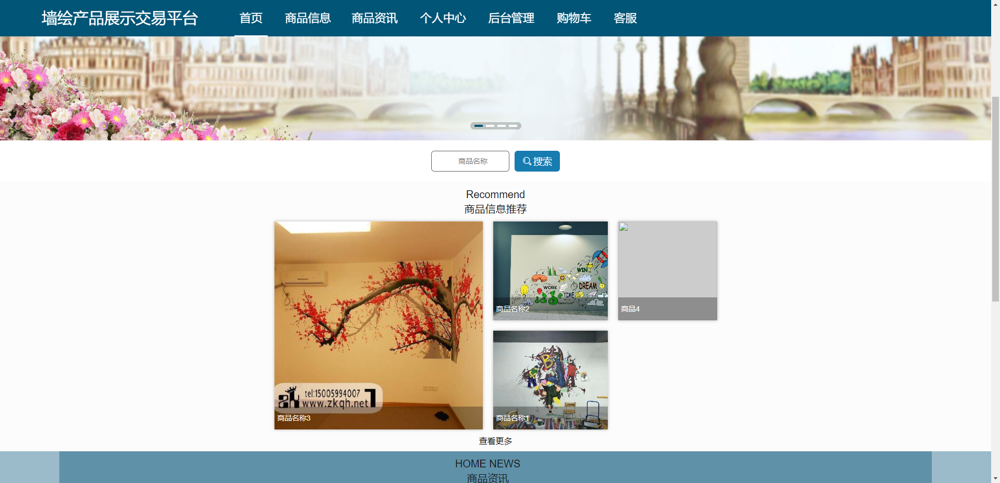


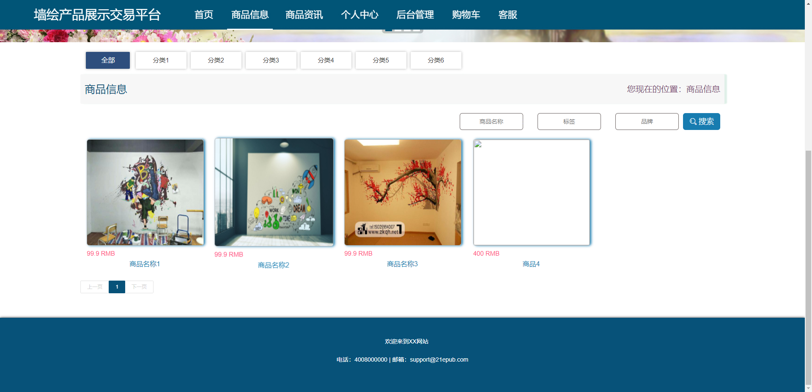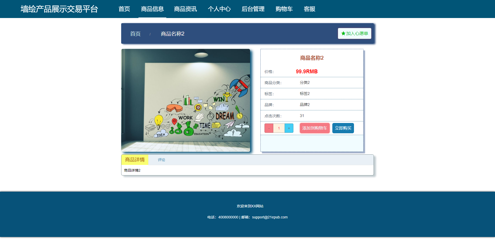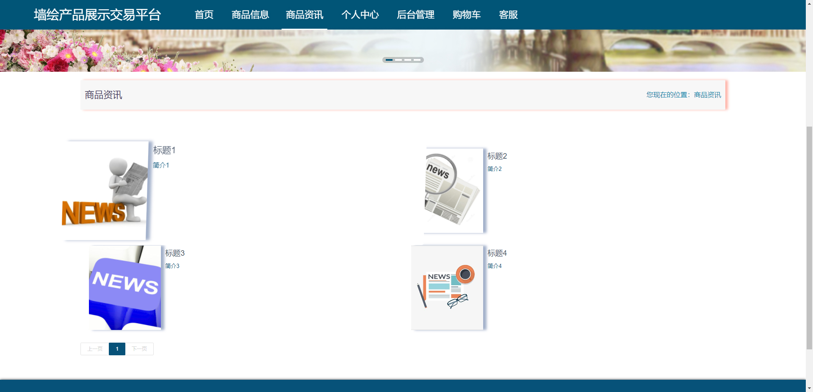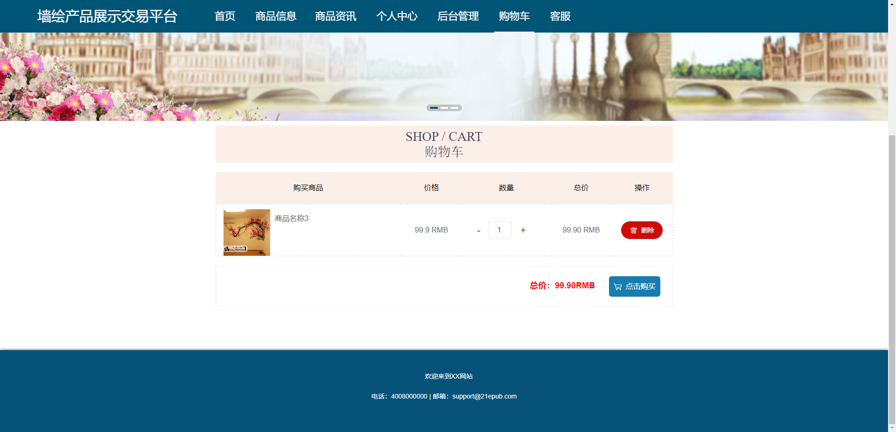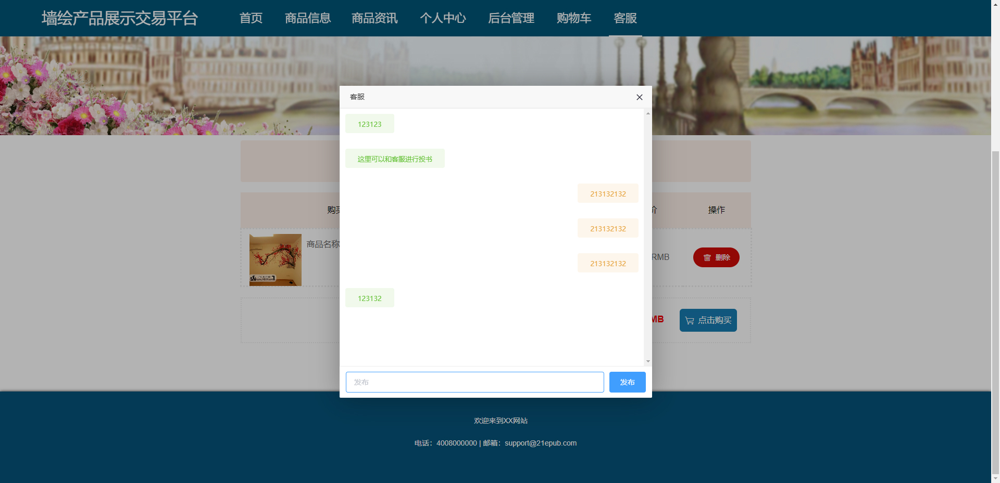


### 后台


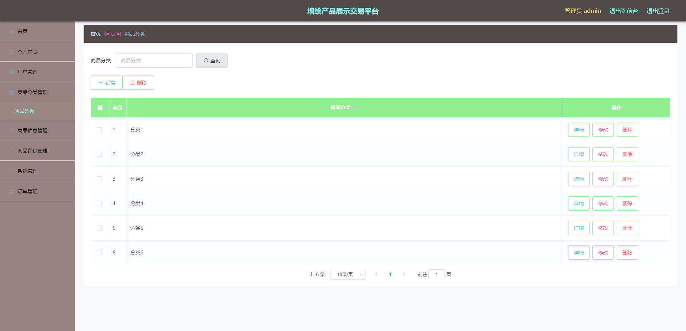

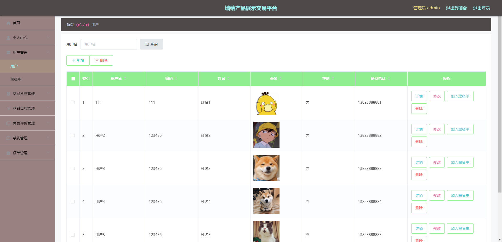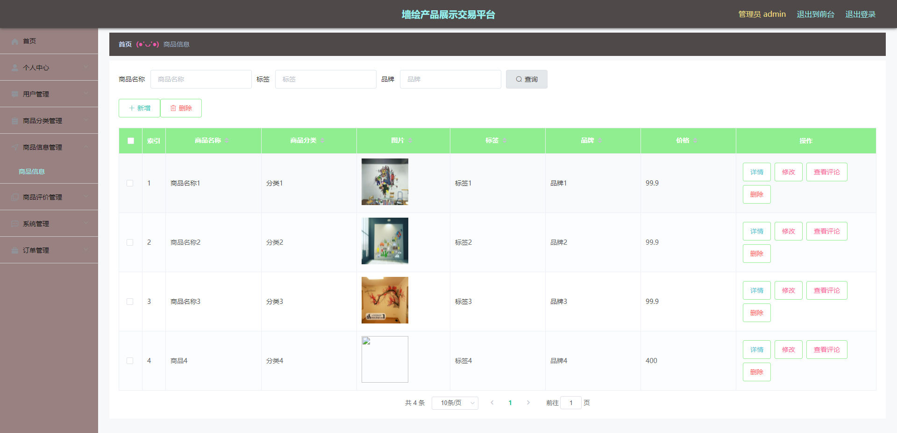

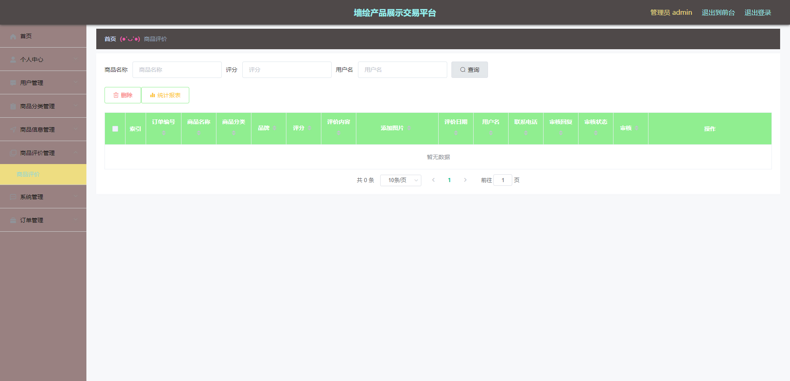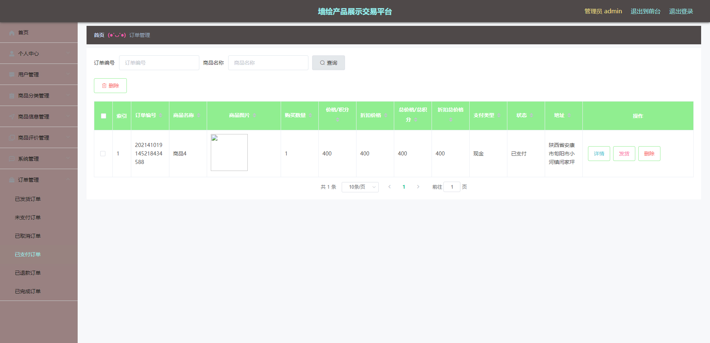


## 访问路径

### 前台

```properties
http://localhost:8080/qianghuichapin/front/pages/login/login.html

账号 111
密码 111
```

### 后台

```properties
http://localhost:8080/qianghuichapin/admin/dist/index.html#/login

账号 admin
密码 admin
```


## 功能图

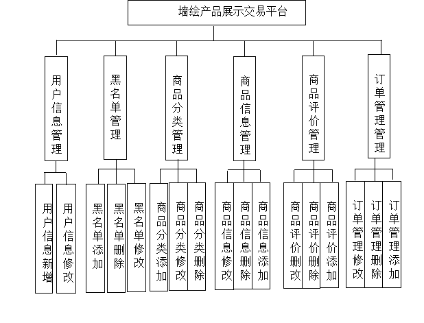


## 文档目录

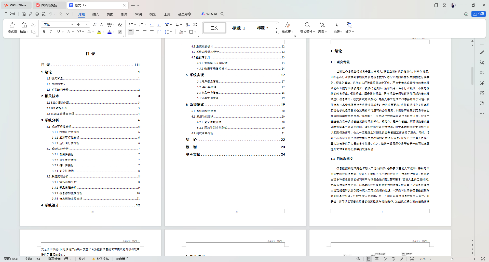


## 打赏或交流


